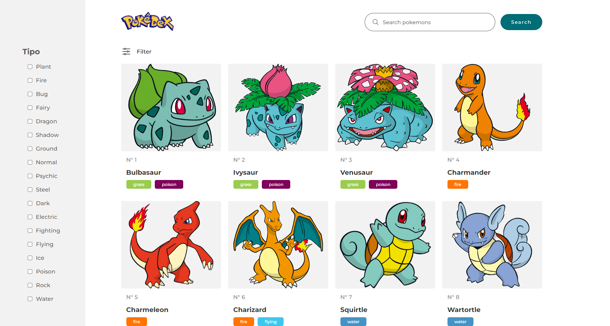

# pokedex-react



## Description

Pokedex using React and Pokemon API, developed in 2024.

## Index

- [Instalation](#instalation)
- [Usage](#usage)
- [Live Preview](#live-preview)
- [License](#license)

## Instalation

```
npm install 
```

## Usage

```
npm run dev
```

## Live Preview

[Pokedex React](https://olivierpaulcris.github.io/pokedex-react/)

## License

GNU GENERAL PUBLIC LICENSE. Version 3, 29 June 2007. Copyright (C) 2007 Free Software Foundation, Inc. <https://fsf.org/> Everyone is permitted to copy and distribute verbatim copies of this license document, but changing it is not allowed.
